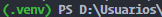

<!-- @format -->

# Reto-5_MiniProyectos

Para la ejecución del proyecto debes seguir estos simples pasos:

## Instalar flask

Debes instalar FLASK para ejecutar el servidor y visualizar la app.

con esta linea de comando lo instalas en la terminal VSC o tu terminal de preferencia

```bash
  pip install Flask
```

## Luego de instalar debes activar el script con esta linea de comando

```bash
 .venv\Scripts\activate
```

## si ya esta activado puede verificar que antes de dirección de la terminal se encuentra esta linas:

```bash
 
```

## ya por terminar corres la app con este comando

```bash
 flask --app app --debug run
```

## Ahi puedes explorar todo.

```bash
Nota: las paginas del ciclo 2 se debe correr individualmente con la ubicación del proyecto y inciando cada archivo.py para visuañizar el resultado en consola
```

## para detener el servido FLASK con esta liena de comando

```bash
 deactivate
```

# Muchas gracias...
